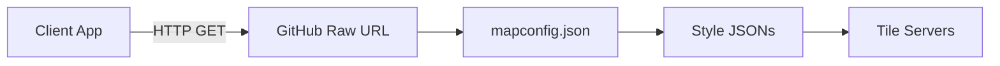
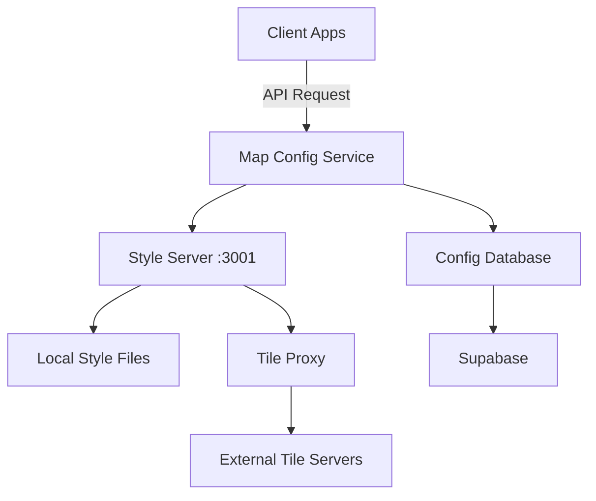
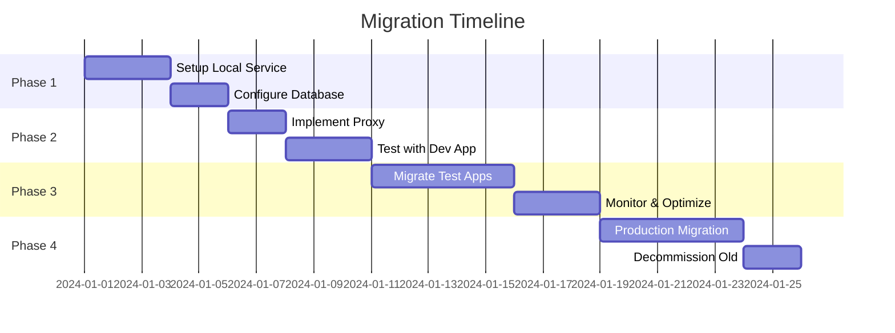

# Map Configuration Service Integration Manual

## Executive Summary
This manual provides a comprehensive guide for migrating applications from GitHub-hosted map configurations to a local service-based architecture. The migration addresses challenges with private repositories, improves performance through local caching, and provides better control over map style distribution.

## Table of Contents
1. [Current Architecture Analysis](#1-current-architecture-analysis)
2. [Target Architecture Overview](#2-target-architecture-overview)
3. [Pre-Migration Assessment](#3-pre-migration-assessment)
4. [Migration Strategy](#4-migration-strategy)
5. [Step-by-Step Implementation](#5-step-by-step-implementation)
6. [Testing & Validation](#6-testing--validation)
7. [Deployment Options](#7-deployment-options)
8. [Rollback Strategy](#8-rollback-strategy)
9. [Performance Considerations](#9-performance-considerations)
10. [Troubleshooting Guide](#10-troubleshooting-guide)

---

## 1. Current Architecture Analysis

### 1.1 Existing Implementation
Your application currently loads map configurations from:
```javascript
const defaultConfigUrl = 'https://raw.githubusercontent.com/geolantis/basemap/refs/heads/main/mapconfig.json';
```

### 1.2 Current Flow


### 1.3 Pain Points
- **Private Repository Access**: Raw URLs don't work with private repos
- **CORS Issues**: Cross-origin requests to tile servers
- **No Caching Control**: Dependent on GitHub's caching
- **Single Point of Failure**: GitHub availability
- **No Request Analytics**: Can't track usage patterns
- **Limited Customization**: Can't modify responses dynamically

---

## 2. Target Architecture Overview

### 2.1 New Service Architecture


### 2.2 Key Components

#### Style Server (Express.js)
- **Port**: 3001
- **Purpose**: Serves style JSON files and proxies tile requests
- **Features**: CORS handling, caching, reference resolution

#### Map Configuration API
- **Database**: Supabase PostgreSQL
- **Storage**: Local filesystem for style files
- **Caching**: 5-minute cache headers

#### Proxy Endpoints
- Kataster tiles: `/proxy/kataster/*`
- KTN tiles: `/proxy/ktn/*`
- Custom tile servers: Configurable

---

## 3. Pre-Migration Assessment

### 3.1 Inventory Checklist

- [ ] **Identify all applications** using the GitHub URL
- [ ] **List all map styles** currently in use
- [ ] **Document custom modifications** to styles
- [ ] **Catalog tile server dependencies**
- [ ] **Review authentication requirements**
- [ ] **Assess traffic patterns** and load requirements

### 3.2 Dependency Analysis

```javascript
// Search your codebase for these patterns:
const patterns = [
  'raw.githubusercontent.com/geolantis/basemap',
  'mapconfig.json',
  'kataster.bev.gv.at',
  'gis.ktn.gv.at',
  'api.maptiler.com'
];
```

### 3.3 Risk Assessment

| Risk | Impact | Mitigation |
|------|--------|------------|
| Service downtime | High | Implement fallback to cached configs |
| Performance degradation | Medium | Use CDN and optimize caching |
| CORS issues | Medium | Proper proxy configuration |
| Data sync issues | Low | Automated sync scripts |

---

## 4. Migration Strategy

### 4.1 Phased Approach



### 4.2 Migration Patterns

#### Pattern A: Direct Replacement
```javascript
// OLD
const mapConfig = await fetch('https://raw.githubusercontent.com/geolantis/basemap/refs/heads/main/mapconfig.json');

// NEW
const mapConfig = await fetch('http://localhost:3001/api/mapconfig');
```

#### Pattern B: With Fallback
```javascript
async function loadMapConfig() {
  const endpoints = [
    'http://localhost:3001/api/mapconfig',
    'https://fallback-server.com/mapconfig',
    '/cached/mapconfig.json' // Local fallback
  ];
  
  for (const endpoint of endpoints) {
    try {
      const response = await fetch(endpoint);
      if (response.ok) return response.json();
    } catch (error) {
      console.warn(`Failed to load from ${endpoint}:`, error);
    }
  }
  throw new Error('All map config endpoints failed');
}
```

---

## 5. Step-by-Step Implementation

### 5.1 Service Setup

#### Step 1: Install Dependencies
```bash
cd map-config-service/web
npm install express cors dotenv
npm install -D nodemon concurrently
```

#### Step 2: Configure Environment
```bash
# Create .env file
cat > .env << EOF
PORT=3001
STYLE_SERVER_URL=http://localhost:3001
BASEMAP_REPO_PATH=/Users/michael/Development/basemap
CORS_ORIGIN=*
CACHE_DURATION=300
EOF
```

#### Step 3: Start Style Server
```bash
# Development mode with auto-reload
npm run styles:server

# Production mode
NODE_ENV=production node server.js
```

### 5.2 Application Integration

#### Step 1: Create Configuration Module
```javascript
// mapConfigService.js
class MapConfigService {
  constructor(options = {}) {
    this.baseUrl = options.baseUrl || 'http://localhost:3001';
    this.fallbackUrl = options.fallbackUrl || null;
    this.cache = new Map();
    this.cacheTimeout = options.cacheTimeout || 300000; // 5 minutes
  }

  async loadConfig() {
    // Check cache first
    const cached = this.getFromCache('config');
    if (cached) return cached;

    try {
      const response = await fetch(`${this.baseUrl}/api/mapconfig`);
      if (!response.ok) throw new Error(`HTTP ${response.status}`);
      
      const config = await response.json();
      this.setCache('config', config);
      return config;
    } catch (error) {
      console.error('Failed to load from service:', error);
      
      // Try fallback
      if (this.fallbackUrl) {
        return this.loadFallback();
      }
      throw error;
    }
  }

  async loadStyle(styleName) {
    const cached = this.getFromCache(`style:${styleName}`);
    if (cached) return cached;

    const response = await fetch(`${this.baseUrl}/api/styles/${styleName}`);
    const style = await response.json();
    
    this.setCache(`style:${styleName}`, style);
    return style;
  }

  async loadFallback() {
    const response = await fetch(this.fallbackUrl);
    return response.json();
  }

  getFromCache(key) {
    const item = this.cache.get(key);
    if (!item) return null;
    
    if (Date.now() - item.timestamp > this.cacheTimeout) {
      this.cache.delete(key);
      return null;
    }
    
    return item.data;
  }

  setCache(key, data) {
    this.cache.set(key, {
      data,
      timestamp: Date.now()
    });
  }

  // Proxy tile URL through service
  getTileUrl(originalUrl) {
    if (originalUrl.includes('kataster.bev.gv.at')) {
      return originalUrl.replace(
        'https://kataster.bev.gv.at',
        `${this.baseUrl}/proxy/kataster`
      );
    }
    if (originalUrl.includes('gis.ktn.gv.at')) {
      return originalUrl.replace(
        'https://gis.ktn.gv.at',
        `${this.baseUrl}/proxy/ktn`
      );
    }
    return originalUrl;
  }
}

export default MapConfigService;
```

#### Step 2: Update Map Initialization
```javascript
// mapInitializer.js
import MapConfigService from './mapConfigService.js';
import maplibregl from 'maplibre-gl';

class MapInitializer {
  constructor() {
    this.configService = new MapConfigService({
      baseUrl: process.env.MAP_SERVICE_URL || 'http://localhost:3001',
      fallbackUrl: '/static/mapconfig.json'
    });
  }

  async initializeMap(containerId, options = {}) {
    try {
      // Load configuration
      const config = await this.configService.loadConfig();
      
      // Select base map
      const baseMapId = options.baseMap || 'Global';
      const baseMap = config.backgroundMaps[baseMapId];
      
      if (!baseMap) {
        throw new Error(`Base map '${baseMapId}' not found`);
      }

      // Load style
      let style;
      if (baseMap.style.startsWith('http://localhost:3001')) {
        // Load from our service
        const styleName = baseMap.style.split('/').pop();
        style = await this.configService.loadStyle(styleName);
      } else {
        // External style URL
        style = baseMap.style;
      }

      // Initialize map
      const map = new maplibregl.Map({
        container: containerId,
        style: style,
        center: options.center || [14.3053, 46.6364],
        zoom: options.zoom || 10,
        ...options.mapOptions
      });

      // Add overlays if specified
      if (options.overlays) {
        map.on('load', () => {
          this.addOverlays(map, config, options.overlays);
        });
      }

      return map;
    } catch (error) {
      console.error('Failed to initialize map:', error);
      throw error;
    }
  }

  async addOverlays(map, config, overlayIds) {
    for (const overlayId of overlayIds) {
      const overlay = config.overlayMaps[overlayId];
      if (!overlay) {
        console.warn(`Overlay '${overlayId}' not found`);
        continue;
      }

      try {
        // Process overlay based on type
        if (overlay.type === 'vtc') {
          await this.addVectorOverlay(map, overlay);
        } else if (overlay.type === 'wms') {
          this.addWMSOverlay(map, overlay);
        }
      } catch (error) {
        console.error(`Failed to add overlay '${overlayId}':`, error);
      }
    }
  }

  async addVectorOverlay(map, overlay) {
    // Load style if it's from our service
    let style;
    if (overlay.style?.startsWith('http://localhost:3001')) {
      const styleName = overlay.style.split('/').pop();
      style = await this.configService.loadStyle(styleName);
    } else {
      style = overlay.style;
    }

    // Add source
    const sourceId = `overlay-${overlay.id}`;
    if (style.sources) {
      Object.entries(style.sources).forEach(([id, source]) => {
        if (!map.getSource(`${sourceId}-${id}`)) {
          // Update tile URLs to use proxy
          if (source.tiles) {
            source.tiles = source.tiles.map(url => 
              this.configService.getTileUrl(url)
            );
          }
          map.addSource(`${sourceId}-${id}`, source);
        }
      });
    }

    // Add layers
    if (style.layers) {
      style.layers.forEach(layer => {
        const layerId = `${sourceId}-${layer.id}`;
        if (!map.getLayer(layerId)) {
          map.addLayer({
            ...layer,
            id: layerId,
            source: layer.source ? `${sourceId}-${layer.source}` : layer.source
          });
        }
      });
    }
  }

  addWMSOverlay(map, overlay) {
    const sourceId = `wms-${overlay.id}`;
    
    if (!map.getSource(sourceId)) {
      map.addSource(sourceId, {
        type: 'raster',
        tiles: [overlay.url],
        tileSize: 256
      });

      map.addLayer({
        id: sourceId,
        type: 'raster',
        source: sourceId,
        paint: {
          'raster-opacity': overlay.opacity || 0.7
        }
      });
    }
  }
}

export default MapInitializer;
```

#### Step 3: Update Application Entry Point
```javascript
// app.js
import MapInitializer from './mapInitializer.js';

// Initialize map when DOM is ready
document.addEventListener('DOMContentLoaded', async () => {
  const mapInit = new MapInitializer();
  
  try {
    const map = await mapInit.initializeMap('map', {
      baseMap: 'Global',
      overlays: ['kataster-bev2'],
      center: [14.3053, 46.6364],
      zoom: 12,
      mapOptions: {
        attributionControl: false
      }
    });

    // Add controls
    map.addControl(new maplibregl.NavigationControl());
    map.addControl(new maplibregl.ScaleControl());

    // Handle map events
    map.on('load', () => {
      console.log('Map loaded successfully');
    });

    map.on('error', (e) => {
      console.error('Map error:', e);
    });

  } catch (error) {
    console.error('Failed to initialize map:', error);
    // Show error message to user
    document.getElementById('map').innerHTML = `
      <div class="error-message">
        Failed to load map. Please try again later.
      </div>
    `;
  }
});
```

### 5.3 Database Configuration

#### Step 1: Update Supabase Schema
```sql
-- Add metadata columns to map_configs table
ALTER TABLE map_configs 
ADD COLUMN IF NOT EXISTS use_style_server BOOLEAN DEFAULT true,
ADD COLUMN IF NOT EXISTS style_server_url TEXT,
ADD COLUMN IF NOT EXISTS proxy_tiles BOOLEAN DEFAULT true,
ADD COLUMN IF NOT EXISTS cache_duration INTEGER DEFAULT 300;

-- Update existing records
UPDATE map_configs 
SET 
  use_style_server = true,
  style_server_url = 'http://localhost:3001',
  proxy_tiles = true
WHERE style_url LIKE '%github.com%';
```

#### Step 2: Create Migration Script
```javascript
// migrate-to-service.js
import { createClient } from '@supabase/supabase-js';
import { config } from 'dotenv';

config();

const supabase = createClient(
  process.env.SUPABASE_URL,
  process.env.SUPABASE_KEY
);

async function migrateConfigs() {
  // Fetch all configs
  const { data: configs, error } = await supabase
    .from('map_configs')
    .select('*');

  if (error) {
    console.error('Failed to fetch configs:', error);
    return;
  }

  const updates = [];
  
  for (const config of configs) {
    // Update style URLs
    if (config.style_url?.includes('github.com')) {
      const styleName = config.style_url.split('/').pop().replace('.json', '');
      
      updates.push({
        id: config.id,
        style_url: `http://localhost:3001/api/styles/${styleName}`,
        metadata: {
          ...config.metadata,
          original_url: config.style_url,
          use_style_server: true,
          migrated_at: new Date().toISOString()
        }
      });
    }
  }

  // Batch update
  for (const update of updates) {
    const { error } = await supabase
      .from('map_configs')
      .update(update)
      .eq('id', update.id);

    if (error) {
      console.error(`Failed to update config ${update.id}:`, error);
    } else {
      console.log(`Updated config ${update.id}`);
    }
  }

  console.log(`Migration complete. Updated ${updates.length} configs.`);
}

migrateConfigs();
```

---

## 6. Testing & Validation

### 6.1 Unit Tests

```javascript
// tests/mapConfigService.test.js
import { describe, it, expect, beforeEach, vi } from 'vitest';
import MapConfigService from '../mapConfigService.js';

describe('MapConfigService', () => {
  let service;

  beforeEach(() => {
    service = new MapConfigService({
      baseUrl: 'http://localhost:3001'
    });
    vi.clearAllMocks();
  });

  it('should load configuration from service', async () => {
    const mockConfig = { backgroundMaps: {}, overlayMaps: {} };
    global.fetch = vi.fn().mockResolvedValue({
      ok: true,
      json: () => Promise.resolve(mockConfig)
    });

    const config = await service.loadConfig();
    
    expect(fetch).toHaveBeenCalledWith('http://localhost:3001/api/mapconfig');
    expect(config).toEqual(mockConfig);
  });

  it('should cache configurations', async () => {
    const mockConfig = { test: 'data' };
    global.fetch = vi.fn().mockResolvedValue({
      ok: true,
      json: () => Promise.resolve(mockConfig)
    });

    // First call
    await service.loadConfig();
    // Second call should use cache
    await service.loadConfig();

    expect(fetch).toHaveBeenCalledTimes(1);
  });

  it('should proxy tile URLs correctly', () => {
    const katasterUrl = 'https://kataster.bev.gv.at/tiles/1/2/3.pbf';
    const proxied = service.getTileUrl(katasterUrl);
    
    expect(proxied).toBe('http://localhost:3001/proxy/kataster/tiles/1/2/3.pbf');
  });

  it('should fall back when service fails', async () => {
    service.fallbackUrl = '/static/config.json';
    
    global.fetch = vi.fn()
      .mockRejectedValueOnce(new Error('Service down'))
      .mockResolvedValueOnce({
        ok: true,
        json: () => Promise.resolve({ fallback: true })
      });

    const config = await service.loadConfig();
    
    expect(config).toEqual({ fallback: true });
    expect(fetch).toHaveBeenCalledTimes(2);
  });
});
```

### 6.2 Integration Tests

```javascript
// tests/integration/mapIntegration.test.js
import { test, expect } from '@playwright/test';

test.describe('Map Integration', () => {
  test.beforeEach(async ({ page }) => {
    await page.goto('http://localhost:5173/test-map.html');
  });

  test('should load map with local service', async ({ page }) => {
    // Wait for map to load
    await page.waitForSelector('#map .maplibregl-canvas', {
      timeout: 10000
    });

    // Check if map is rendered
    const canvas = await page.$('#map canvas');
    expect(canvas).toBeTruthy();

    // Verify style server requests
    const styleRequests = [];
    page.on('request', request => {
      if (request.url().includes('localhost:3001/api/styles')) {
        styleRequests.push(request.url());
      }
    });

    // Trigger style change
    await page.click('#change-style-btn');
    await page.waitForTimeout(1000);

    expect(styleRequests.length).toBeGreaterThan(0);
  });

  test('should handle proxy requests', async ({ page }) => {
    const proxyRequests = [];
    page.on('request', request => {
      if (request.url().includes('/proxy/')) {
        proxyRequests.push(request.url());
      }
    });

    // Add overlay that uses proxy
    await page.click('#add-kataster-overlay');
    await page.waitForTimeout(2000);

    expect(proxyRequests.length).toBeGreaterThan(0);
  });

  test('should fall back on service failure', async ({ page }) => {
    // Block service requests
    await page.route('**/localhost:3001/**', route => route.abort());

    // Should still load from fallback
    await page.reload();
    await page.waitForSelector('#map .maplibregl-canvas', {
      timeout: 10000
    });

    const errorLogs = await page.evaluate(() => {
      return window.consoleErrors || [];
    });

    expect(errorLogs).toContain('Failed to load from service');
  });
});
```

### 6.3 Performance Tests

```javascript
// tests/performance/loadTest.js
import http from 'k6/http';
import { check, sleep } from 'k6';

export let options = {
  stages: [
    { duration: '30s', target: 10 },  // Ramp up
    { duration: '1m', target: 50 },   // Stay at 50 users
    { duration: '30s', target: 0 },   // Ramp down
  ],
  thresholds: {
    http_req_duration: ['p(95)<500'], // 95% of requests under 500ms
    http_req_failed: ['rate<0.1'],    // Error rate under 10%
  },
};

export default function () {
  // Test config endpoint
  let response = http.get('http://localhost:3001/api/mapconfig');
  check(response, {
    'config status is 200': (r) => r.status === 200,
    'config response time < 200ms': (r) => r.timings.duration < 200,
  });

  sleep(1);

  // Test style endpoint
  response = http.get('http://localhost:3001/api/styles/basemap');
  check(response, {
    'style status is 200': (r) => r.status === 200,
    'style response time < 300ms': (r) => r.timings.duration < 300,
  });

  sleep(1);
}
```

---

## 7. Deployment Options

### 7.1 Docker Deployment

```dockerfile
# Dockerfile
FROM node:18-alpine

WORKDIR /app

# Copy package files
COPY package*.json ./
RUN npm ci --only=production

# Copy application files
COPY server.js ./
COPY styles ./styles

# Set environment
ENV NODE_ENV=production
ENV PORT=3001

EXPOSE 3001

CMD ["node", "server.js"]
```

```yaml
# docker-compose.yml
version: '3.8'

services:
  style-server:
    build: .
    ports:
      - "3001:3001"
    environment:
      - NODE_ENV=production
      - BASEMAP_REPO_PATH=/data/styles
    volumes:
      - ./styles:/data/styles:ro
    restart: unless-stopped
    healthcheck:
      test: ["CMD", "curl", "-f", "http://localhost:3001/health"]
      interval: 30s
      timeout: 10s
      retries: 3

  nginx:
    image: nginx:alpine
    ports:
      - "80:80"
      - "443:443"
    volumes:
      - ./nginx.conf:/etc/nginx/nginx.conf:ro
      - ./certs:/etc/nginx/certs:ro
    depends_on:
      - style-server
    restart: unless-stopped
```

### 7.2 Cloud Deployment

#### Vercel Deployment
```javascript
// vercel.json
{
  "version": 2,
  "builds": [
    {
      "src": "server.js",
      "use": "@vercel/node"
    }
  ],
  "routes": [
    {
      "src": "/api/(.*)",
      "dest": "/server.js"
    },
    {
      "src": "/proxy/(.*)",
      "dest": "/server.js"
    }
  ],
  "env": {
    "NODE_ENV": "production"
  }
}
```

#### AWS Lambda Deployment
```javascript
// lambda.js
import serverlessExpress from '@vendia/serverless-express';
import app from './server.js';

export const handler = serverlessExpress({ app });
```

### 7.3 CDN Configuration

```nginx
# nginx.conf for CDN
http {
    proxy_cache_path /var/cache/nginx levels=1:2 keys_zone=styles_cache:10m max_size=1g inactive=60m;

    upstream style_server {
        server localhost:3001;
        keepalive 64;
    }

    server {
        listen 80;
        server_name maps.yourdomain.com;

        location /api/styles/ {
            proxy_pass http://style_server;
            proxy_cache styles_cache;
            proxy_cache_valid 200 5m;
            proxy_cache_key "$request_uri";
            
            add_header X-Cache-Status $upstream_cache_status;
            add_header Cache-Control "public, max-age=300";
            
            # CORS headers
            add_header Access-Control-Allow-Origin *;
            add_header Access-Control-Allow-Methods "GET, OPTIONS";
        }

        location /proxy/ {
            proxy_pass http://style_server;
            proxy_buffering off;
            proxy_set_header X-Real-IP $remote_addr;
            proxy_set_header X-Forwarded-For $proxy_add_x_forwarded_for;
        }
    }
}
```

---

## 8. Rollback Strategy

### 8.1 Rollback Plan

```javascript
// rollback.js
class RollbackManager {
  constructor() {
    this.checkpoints = [];
  }

  createCheckpoint(name) {
    const checkpoint = {
      name,
      timestamp: Date.now(),
      configs: this.backupCurrentConfigs(),
      environment: this.captureEnvironment()
    };
    
    this.checkpoints.push(checkpoint);
    return checkpoint;
  }

  async rollback(checkpointName) {
    const checkpoint = this.checkpoints.find(cp => cp.name === checkpointName);
    if (!checkpoint) {
      throw new Error(`Checkpoint '${checkpointName}' not found`);
    }

    console.log(`Rolling back to checkpoint: ${checkpointName}`);
    
    // Restore configurations
    await this.restoreConfigs(checkpoint.configs);
    
    // Restore environment
    await this.restoreEnvironment(checkpoint.environment);
    
    // Clear caches
    await this.clearAllCaches();
    
    // Notify monitoring
    await this.notifyRollback(checkpoint);
    
    return checkpoint;
  }

  async backupCurrentConfigs() {
    // Implementation to backup current state
    const configs = {};
    
    // Backup database
    configs.database = await this.backupDatabase();
    
    // Backup files
    configs.files = await this.backupFiles();
    
    // Backup environment
    configs.env = process.env;
    
    return configs;
  }

  async restoreConfigs(configs) {
    // Restore database
    await this.restoreDatabase(configs.database);
    
    // Restore files
    await this.restoreFiles(configs.files);
    
    // Restore environment
    process.env = { ...configs.env };
  }
}
```

### 8.2 Fallback Configuration

```javascript
// fallbackConfig.js
export const fallbackEndpoints = [
  {
    name: 'primary',
    url: 'http://localhost:3001',
    priority: 1,
    timeout: 5000
  },
  {
    name: 'secondary',
    url: 'https://backup-server.com',
    priority: 2,
    timeout: 5000
  },
  {
    name: 'static',
    url: '/static/emergency-config.json',
    priority: 3,
    timeout: 1000
  }
];

export async function loadWithFallback() {
  const errors = [];
  
  for (const endpoint of fallbackEndpoints.sort((a, b) => a.priority - b.priority)) {
    try {
      const controller = new AbortController();
      const timeout = setTimeout(() => controller.abort(), endpoint.timeout);
      
      const response = await fetch(`${endpoint.url}/api/mapconfig`, {
        signal: controller.signal
      });
      
      clearTimeout(timeout);
      
      if (response.ok) {
        console.log(`Loaded from ${endpoint.name}`);
        return response.json();
      }
    } catch (error) {
      errors.push({ endpoint: endpoint.name, error });
    }
  }
  
  console.error('All endpoints failed:', errors);
  throw new Error('Unable to load map configuration');
}
```

---

## 9. Performance Considerations

### 9.1 Caching Strategy

```javascript
// cacheManager.js
class CacheManager {
  constructor() {
    this.memoryCache = new Map();
    this.storageCache = this.initStorageCache();
  }

  initStorageCache() {
    if (typeof window !== 'undefined' && window.localStorage) {
      return {
        get: (key) => {
          const item = localStorage.getItem(key);
          if (!item) return null;
          
          const { data, expires } = JSON.parse(item);
          if (Date.now() > expires) {
            localStorage.removeItem(key);
            return null;
          }
          
          return data;
        },
        set: (key, data, ttl = 300000) => {
          localStorage.setItem(key, JSON.stringify({
            data,
            expires: Date.now() + ttl
          }));
        },
        clear: () => localStorage.clear()
      };
    }
    return null;
  }

  async get(key, fetcher, options = {}) {
    // Check memory cache
    if (this.memoryCache.has(key)) {
      const item = this.memoryCache.get(key);
      if (Date.now() < item.expires) {
        return item.data;
      }
      this.memoryCache.delete(key);
    }

    // Check storage cache
    if (this.storageCache) {
      const cached = this.storageCache.get(key);
      if (cached) {
        // Promote to memory cache
        this.memoryCache.set(key, {
          data: cached,
          expires: Date.now() + (options.ttl || 300000)
        });
        return cached;
      }
    }

    // Fetch fresh data
    const data = await fetcher();
    
    // Store in caches
    const ttl = options.ttl || 300000;
    this.memoryCache.set(key, {
      data,
      expires: Date.now() + ttl
    });
    
    if (this.storageCache) {
      this.storageCache.set(key, data, ttl);
    }

    return data;
  }

  invalidate(pattern) {
    // Invalidate memory cache
    for (const key of this.memoryCache.keys()) {
      if (key.includes(pattern)) {
        this.memoryCache.delete(key);
      }
    }

    // Invalidate storage cache
    if (this.storageCache && typeof window !== 'undefined') {
      for (let i = 0; i < localStorage.length; i++) {
        const key = localStorage.key(i);
        if (key && key.includes(pattern)) {
          localStorage.removeItem(key);
        }
      }
    }
  }
}
```

### 9.2 Request Optimization

```javascript
// requestOptimizer.js
class RequestOptimizer {
  constructor() {
    this.pending = new Map();
    this.batch = [];
    this.batchTimer = null;
  }

  // Deduplicate concurrent requests
  async dedupe(key, fetcher) {
    if (this.pending.has(key)) {
      return this.pending.get(key);
    }

    const promise = fetcher().finally(() => {
      this.pending.delete(key);
    });

    this.pending.set(key, promise);
    return promise;
  }

  // Batch multiple requests
  batchRequest(request) {
    return new Promise((resolve, reject) => {
      this.batch.push({ request, resolve, reject });
      
      if (!this.batchTimer) {
        this.batchTimer = setTimeout(() => {
          this.processBatch();
        }, 10);
      }
    });
  }

  async processBatch() {
    const batch = [...this.batch];
    this.batch = [];
    this.batchTimer = null;

    if (batch.length === 0) return;

    try {
      // Send batched request
      const response = await fetch('/api/batch', {
        method: 'POST',
        headers: { 'Content-Type': 'application/json' },
        body: JSON.stringify({
          requests: batch.map(b => b.request)
        })
      });

      const results = await response.json();
      
      // Resolve individual promises
      batch.forEach((item, index) => {
        if (results[index].error) {
          item.reject(new Error(results[index].error));
        } else {
          item.resolve(results[index].data);
        }
      });
    } catch (error) {
      // Reject all promises on batch failure
      batch.forEach(item => item.reject(error));
    }
  }

  // Prefetch resources
  prefetch(urls) {
    if (typeof window !== 'undefined' && 'requestIdleCallback' in window) {
      requestIdleCallback(() => {
        urls.forEach(url => {
          const link = document.createElement('link');
          link.rel = 'prefetch';
          link.href = url;
          document.head.appendChild(link);
        });
      });
    }
  }
}
```

---

## 10. Troubleshooting Guide

### 10.1 Common Issues

#### Issue: CORS Errors
```javascript
// Solution: Update server CORS configuration
app.use(cors({
  origin: function (origin, callback) {
    // Allow all origins in development
    if (process.env.NODE_ENV === 'development') {
      callback(null, true);
    } else {
      // Whitelist origins in production
      const whitelist = [
        'https://yourdomain.com',
        'https://app.yourdomain.com'
      ];
      if (whitelist.indexOf(origin) !== -1 || !origin) {
        callback(null, true);
      } else {
        callback(new Error('Not allowed by CORS'));
      }
    }
  },
  credentials: true,
  methods: ['GET', 'POST', 'OPTIONS'],
  allowedHeaders: ['Content-Type', 'Authorization']
}));
```

#### Issue: Style Files Not Found
```javascript
// Diagnostic script
async function diagnoseStyleFiles() {
  const fs = require('fs').promises;
  const path = require('path');
  
  const styleDir = '/Users/michael/Development/basemap';
  const requiredFiles = [
    'mapconfig.json',
    'basemap.json',
    'kataster-bev2.json'
  ];

  console.log('Checking style files...\n');
  
  for (const file of requiredFiles) {
    const filePath = path.join(styleDir, file);
    try {
      const stats = await fs.stat(filePath);
      console.log(`✅ ${file} - ${stats.size} bytes`);
      
      // Validate JSON
      const content = await fs.readFile(filePath, 'utf8');
      JSON.parse(content);
      console.log(`   Valid JSON structure`);
    } catch (error) {
      console.log(`❌ ${file} - ${error.message}`);
    }
  }
}
```

#### Issue: Proxy Not Working
```javascript
// Test proxy endpoints
async function testProxy() {
  const tests = [
    {
      name: 'Kataster Proxy',
      url: 'http://localhost:3001/proxy/kataster/styles/kataster/14/8831/5673.pbf'
    },
    {
      name: 'KTN Proxy',
      url: 'http://localhost:3001/proxy/ktn/osgdi/tilesets/gst_bev/14/8831/5673.pbf'
    }
  ];

  for (const test of tests) {
    try {
      const response = await fetch(test.url, { method: 'HEAD' });
      console.log(`${test.name}: ${response.status} ${response.statusText}`);
      console.log(`  Redirects to: ${response.url}`);
    } catch (error) {
      console.error(`${test.name}: Failed - ${error.message}`);
    }
  }
}
```

### 10.2 Monitoring & Logging

```javascript
// monitoring.js
class MonitoringService {
  constructor() {
    this.metrics = {
      requests: 0,
      errors: 0,
      latencies: [],
      cacheHits: 0,
      cacheMisses: 0
    };
  }

  logRequest(endpoint, duration, status) {
    this.metrics.requests++;
    this.metrics.latencies.push(duration);
    
    if (status >= 400) {
      this.metrics.errors++;
    }

    // Send to monitoring service
    if (this.metrics.requests % 100 === 0) {
      this.sendMetrics();
    }
  }

  logCacheHit() {
    this.metrics.cacheHits++;
  }

  logCacheMiss() {
    this.metrics.cacheMisses++;
  }

  getStats() {
    const latencies = this.metrics.latencies;
    const avgLatency = latencies.reduce((a, b) => a + b, 0) / latencies.length;
    const p95Latency = this.percentile(latencies, 0.95);

    return {
      totalRequests: this.metrics.requests,
      errorRate: this.metrics.errors / this.metrics.requests,
      avgLatency,
      p95Latency,
      cacheHitRate: this.metrics.cacheHits / (this.metrics.cacheHits + this.metrics.cacheMisses)
    };
  }

  percentile(arr, p) {
    const sorted = arr.slice().sort((a, b) => a - b);
    const index = Math.ceil(sorted.length * p) - 1;
    return sorted[index];
  }

  async sendMetrics() {
    // Send to monitoring service (e.g., DataDog, CloudWatch)
    try {
      await fetch('https://monitoring.service/metrics', {
        method: 'POST',
        headers: { 'Content-Type': 'application/json' },
        body: JSON.stringify(this.getStats())
      });
    } catch (error) {
      console.error('Failed to send metrics:', error);
    }
  }
}
```

### 10.3 Health Checks

```javascript
// healthCheck.js
class HealthChecker {
  async checkAll() {
    const checks = [
      this.checkStyleServer(),
      this.checkDatabase(),
      this.checkTileServers(),
      this.checkCache()
    ];

    const results = await Promise.allSettled(checks);
    
    const status = results.every(r => r.status === 'fulfilled' && r.value.healthy)
      ? 'healthy'
      : 'degraded';

    return {
      status,
      checks: results.map((r, i) => ({
        name: ['style_server', 'database', 'tile_servers', 'cache'][i],
        ...r.value
      })),
      timestamp: new Date().toISOString()
    };
  }

  async checkStyleServer() {
    try {
      const response = await fetch('http://localhost:3001/health');
      return {
        healthy: response.ok,
        latency: response.headers.get('X-Response-Time')
      };
    } catch (error) {
      return {
        healthy: false,
        error: error.message
      };
    }
  }

  async checkDatabase() {
    // Check Supabase connection
    try {
      const { data, error } = await supabase
        .from('map_configs')
        .select('count')
        .single();
      
      return {
        healthy: !error,
        count: data?.count
      };
    } catch (error) {
      return {
        healthy: false,
        error: error.message
      };
    }
  }

  async checkTileServers() {
    const servers = [
      'https://kataster.bev.gv.at',
      'https://gis.ktn.gv.at'
    ];

    const results = await Promise.allSettled(
      servers.map(url => fetch(`${url}/health`, { method: 'HEAD' }))
    );

    return {
      healthy: results.some(r => r.status === 'fulfilled'),
      available: results.filter(r => r.status === 'fulfilled').length,
      total: servers.length
    };
  }

  async checkCache() {
    // Check cache availability
    try {
      const testKey = 'health-check-' + Date.now();
      localStorage.setItem(testKey, 'test');
      localStorage.removeItem(testKey);
      
      return {
        healthy: true,
        type: 'localStorage'
      };
    } catch (error) {
      return {
        healthy: false,
        error: 'Cache unavailable'
      };
    }
  }
}
```

---

## Conclusion

This comprehensive integration manual provides a complete roadmap for migrating from GitHub-hosted map configurations to a robust, local service-based architecture. The new system offers:

- **Better Control**: Full control over configuration and style distribution
- **Improved Performance**: Local caching and optimized delivery
- **Enhanced Reliability**: Multiple fallback options and health monitoring
- **Easier Debugging**: Comprehensive logging and monitoring
- **Scalability**: Ready for production deployment with various options

Follow the step-by-step implementation guide, test thoroughly using the provided test suites, and monitor the system using the health check and monitoring tools. The modular architecture allows for gradual migration and easy rollback if needed.

For additional support or customization needs, refer to the troubleshooting guide or extend the provided modules to meet your specific requirements.