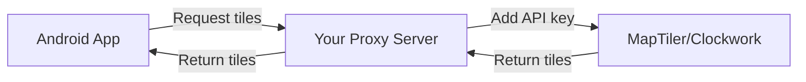

# Secure Map Configuration Solution

## The Security Problem

Current issues with exposing API keys:
1. **Public endpoint** - Anyone can call the URL and get keys
2. **Network sniffing** - Keys visible in HTTPS responses (to authorized apps)
3. **App decompilation** - Tokens/secrets in app code can be extracted
4. **Man-in-the-middle** - Proxies can intercept even HTTPS traffic

## Recommended Solution: Proxy-Based Architecture

Instead of sending API keys to the client, **keep them server-side** and proxy all map tile requests through your server.

### How It Works



The client NEVER sees the API keys - they only see your proxy URLs.

---

## Implementation

### 1. Update Map Configuration Response

Instead of returning:
```json
{
  "style": "https://api.maptiler.com/maps/streets-v2/style.json?key=SECRET_KEY"
}
```

Return:
```json
{
  "style": "https://mapconfig.geolantis.com/api/proxy/style/maptiler-streets-v2"
}
```

### 2. Create Proxy Endpoints

```javascript
// api/proxy/style/[provider].js
export default async function handler(req, res) {
  const { provider } = req.query;
  
  // Validate the request (rate limiting, authentication, etc.)
  if (!validateRequest(req)) {
    return res.status(403).json({ error: 'Forbidden' });
  }
  
  // Map provider to actual URL
  const styleUrls = {
    'maptiler-streets-v2': 'https://api.maptiler.com/maps/streets-v2/style.json',
    'maptiler-landscape': 'https://api.maptiler.com/maps/landscape/style.json',
    'clockwork-streets': 'https://maps.clockworkmicro.com/streets/v1/style'
  };
  
  const targetUrl = styleUrls[provider];
  if (!targetUrl) {
    return res.status(404).json({ error: 'Unknown provider' });
  }
  
  // Add API key server-side
  const apiKey = getApiKeyForProvider(provider);
  const fullUrl = `${targetUrl}?key=${apiKey}`;
  
  // Fetch the style JSON
  const response = await fetch(fullUrl);
  const styleJson = await response.json();
  
  // CRITICAL: Rewrite tile URLs to use our proxy
  if (styleJson.sources) {
    Object.values(styleJson.sources).forEach(source => {
      if (source.tiles) {
        source.tiles = source.tiles.map(tileUrl => 
          rewriteTileUrl(tileUrl, provider)
        );
      }
      if (source.url) {
        source.url = rewriteSourceUrl(source.url, provider);
      }
    });
  }
  
  // Rewrite sprite and glyph URLs
  if (styleJson.sprite) {
    styleJson.sprite = rewriteSpriteUrl(styleJson.sprite, provider);
  }
  if (styleJson.glyphs) {
    styleJson.glyphs = rewriteGlyphsUrl(styleJson.glyphs, provider);
  }
  
  // Return modified style without exposing keys
  res.json(styleJson);
}

function rewriteTileUrl(originalUrl, provider) {
  // Convert: https://api.maptiler.com/tiles/v3/{z}/{x}/{y}.pbf?key=SECRET
  // To: https://mapconfig.geolantis.com/api/proxy/tiles/maptiler-v3/{z}/{x}/{y}.pbf
  const encoded = encodeURIComponent(originalUrl.split('?')[0]);
  return `https://mapconfig.geolantis.com/api/proxy/tiles/${provider}/{z}/{x}/{y}.pbf`;
}
```

### 3. Create Tile Proxy Endpoint

```javascript
// api/proxy/tiles/[...params].js
export default async function handler(req, res) {
  const { params } = req.query;
  const [provider, z, x, y] = params;
  
  // Rate limiting per IP
  if (!checkRateLimit(req)) {
    return res.status(429).json({ error: 'Too many requests' });
  }
  
  // Build actual tile URL with API key
  const tileUrl = buildTileUrl(provider, z, x, y);
  
  // Fetch tile from provider
  const response = await fetch(tileUrl);
  const tile = await response.arrayBuffer();
  
  // Cache headers for performance
  res.setHeader('Cache-Control', 'public, max-age=86400'); // 24 hours
  res.setHeader('Content-Type', response.headers.get('Content-Type'));
  
  // Return tile
  res.send(Buffer.from(tile));
}
```

---

## Android App Implementation

### 1. Update mapConfigLoader.js

```javascript
// No changes needed to the URL
const defaultConfigUrl = 'https://mapconfig.geolantis.com/api/public/mapconfig?format=legacy';

// The response will contain proxy URLs instead of direct URLs with keys
// Example response:
{
  "backgroundMaps": {
    "Global": {
      "style": "https://mapconfig.geolantis.com/api/proxy/style/maptiler-streets-v2",
      // No API key visible!
    }
  }
}
```

### 2. Optional: Add App Authentication

```javascript
// Add a unique app identifier (not a secret, just for tracking)
const APP_ID = 'geolantis360-android-v1';

function loadMapConfig(url = defaultConfigUrl, callback) {
  const headers = {
    'X-App-Id': APP_ID,
    'X-App-Version': '1.0.0',
    'X-Platform': 'android'
  };
  
  loadPromise = fetch(url, { headers })
    .then(response => response.json())
    // ... rest of the code
}
```

---

## Security Benefits

### ✅ What This Solves:

1. **API keys never leave server** - They're only used server-side
2. **Network sniffing useless** - No keys in traffic, only proxy URLs
3. **App decompilation safe** - No secrets in app code
4. **Rate limiting** - Control usage per IP/app
5. **Usage analytics** - Track which apps use which maps
6. **Revocation control** - Block specific apps if compromised
7. **Cost control** - Monitor and limit API usage

### ❌ What This Doesn't Solve:

1. **Bandwidth costs** - You're proxying all tiles
2. **Latency** - Additional hop through your server
3. **Server costs** - Need robust proxy infrastructure

---

## Alternative Solutions

### Option 1: Time-Limited Signed URLs

Generate temporary URLs that expire:

```javascript
// Server generates signed URL valid for 1 hour
function generateSignedUrl(mapStyle) {
  const expires = Date.now() + 3600000; // 1 hour
  const signature = crypto
    .createHmac('sha256', SECRET_KEY)
    .update(`${mapStyle}:${expires}`)
    .digest('hex');
  
  return `https://mapconfig.geolantis.com/api/proxy/style/${mapStyle}?expires=${expires}&sig=${signature}`;
}
```

### Option 2: Per-Session Tokens

Issue temporary tokens per app session:

```javascript
// App requests session token on startup
POST /api/auth/session
Headers: { 'X-App-Id': 'geolantis360' }
Response: { 
  "token": "eyJhbGc...", 
  "expires": 1704067200,
  "mapConfigUrl": "/api/public/mapconfig?session=eyJhbGc..."
}

// Token is used for all subsequent requests
GET /api/public/mapconfig?session=eyJhbGc...
```

### Option 3: Client Certificate Authentication

For maximum security, use mutual TLS:

1. Generate client certificates for each app
2. Embed certificate in Android app
3. Server validates certificate before serving config
4. Only apps with valid certificates get API keys

---

## Recommended Implementation Plan

### Phase 1: Immediate Security (Quick Fix)
1. Remove API keys from public endpoint
2. Return proxy URLs instead
3. Implement basic tile proxying

### Phase 2: Performance Optimization
1. Add CDN caching for tiles
2. Implement edge proxies in multiple regions
3. Use Redis for rate limiting

### Phase 3: Advanced Security
1. Add per-app authentication
2. Implement usage quotas
3. Add anomaly detection
4. Create admin dashboard for monitoring

---

## Cost Considerations

### Proxy Server Costs

| Component | Monthly Cost (Estimate) |
|-----------|------------------------|
| Server (4GB RAM) | $20-40 |
| Bandwidth (1TB) | $10-50 |
| CDN (CloudFlare) | $20+ |
| Redis (caching) | $15+ |
| **Total** | **$65-125/month** |

### Direct API Costs (Current)

| Service | Monthly Cost |
|---------|-------------|
| MapTiler | $25-500 |
| Clockwork | $?? |
| **Risk** | **Unlimited if keys leaked** |

---

## Quick Implementation Code

Here's a minimal secure proxy implementation:

```javascript
// api/public/mapconfig.js - Updated to return proxy URLs
export default async function handler(req, res) {
  // ... existing code ...
  
  const legacyFormat = {
    backgroundMaps: {},
    overlayMaps: {}
  };
  
  // Known maps that need proxying
  const proxyMaps = {
    'Global': 'maptiler-streets-v2',
    'Global2': 'clockwork-streets',
    'Landscape': 'maptiler-landscape',
    'Ocean': 'maptiler-ocean',
    'Outdoor': 'maptiler-outdoor-v2'
  };
  
  configs?.forEach(config => {
    let styleUrl = config.style_url;
    
    // Use proxy URL instead of direct URL with API key
    if (proxyMaps[config.name]) {
      styleUrl = `https://mapconfig.geolantis.com/api/proxy/style/${proxyMaps[config.name]}`;
    }
    
    // ... rest of the code
  });
}
```

```javascript
// api/proxy/style/[styleName].js - New proxy endpoint
import fetch from 'node-fetch';

const STYLE_MAPPINGS = {
  'maptiler-streets-v2': {
    url: 'https://api.maptiler.com/maps/streets-v2/style.json',
    key: process.env.MAPTILER_API_KEY
  },
  'clockwork-streets': {
    url: 'https://maps.clockworkmicro.com/streets/v1/style',
    key: process.env.CLOCKWORK_API_KEY,
    param: 'x-api-key'
  }
};

export default async function handler(req, res) {
  const { styleName } = req.query;
  const config = STYLE_MAPPINGS[styleName];
  
  if (!config) {
    return res.status(404).json({ error: 'Style not found' });
  }
  
  // Add rate limiting
  const ip = req.headers['x-forwarded-for'] || req.connection.remoteAddress;
  if (!checkRateLimit(ip)) {
    return res.status(429).json({ error: 'Rate limit exceeded' });
  }
  
  // Fetch style with API key
  const param = config.param || 'key';
  const url = `${config.url}?${param}=${config.key}`;
  
  const response = await fetch(url);
  const style = await response.json();
  
  // Rewrite URLs to use our proxy
  if (style.sources) {
    Object.values(style.sources).forEach(source => {
      if (source.tiles) {
        source.tiles = source.tiles.map(tileUrl => {
          // Convert tile URL to proxy URL
          const path = tileUrl.replace(/https?:\/\/[^\/]+/, '');
          return `https://mapconfig.geolantis.com/api/proxy/tiles/${styleName}${path}`;
        });
      }
    });
  }
  
  // Cache for 1 hour
  res.setHeader('Cache-Control', 'public, max-age=3600');
  res.json(style);
}
```

---

## Summary

The most secure approach is to **never send API keys to clients**. Instead:

1. **Proxy all requests** through your server
2. **Add API keys server-side** only
3. **Return proxy URLs** to clients
4. **Implement rate limiting** to prevent abuse
5. **Monitor usage** for anomalies

This way, even if someone:
- Decompiles your app ❌ No keys to find
- Sniffs network traffic ❌ No keys in transit  
- Calls your API directly ❌ Gets proxy URLs only
- Tries to abuse the service ❌ Rate limited

The only way to steal your API keys would be to compromise your server, which is much harder than analyzing client code or network traffic.