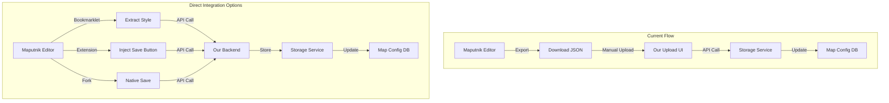

# Maputnik Direct Integration Evaluation (Option 1)

## Executive Summary

This document evaluates the feasibility of implementing direct save functionality from Maputnik to our map configuration system, eliminating the need for users to download and re-upload style files.

**Current State**: Users must export from Maputnik → Download JSON → Upload to our system  
**Desired State**: Users click "Save" in Maputnik → Directly saved to our system

---

## 🔍 Technical Feasibility Analysis

### 1. Maputnik Architecture Constraints

#### **Current Maputnik Limitations:**
- **Static GitHub Pages Hosting**: Maputnik.github.io is a static site
- **No Backend API**: No server-side save functionality
- **No Plugin System**: No official extension points or plugin architecture
- **No PostMessage API**: Limited cross-window communication
- **Read-Only Design**: Designed for editing and exporting, not direct saving

#### **Available Integration Points:**
1. **URL Parameters**: Can pass style URL via hash or query params
2. **Browser Storage**: Can read from localStorage/sessionStorage
3. **Export Function**: Can trigger download programmatically
4. **Style State**: Accessible via browser console (window.maputnikEditor)

### 2. Browser Security Constraints

#### **Cross-Origin Restrictions (CORS):**
- ❌ Cannot directly access Maputnik's DOM from our domain
- ❌ Cannot inject scripts into Maputnik from external sites
- ❌ Cannot read Maputnik's localStorage from our domain
- ❌ PostMessage requires cooperation from both sides

#### **Same-Origin Policy Impact:**
- Our app (web-*.vercel.app) and Maputnik (maputnik.github.io) are different origins
- Direct JavaScript communication blocked by browser security
- Would need Maputnik to explicitly allow our domain

---

## 📊 Implementation Approaches Evaluation

### Approach 1: Browser Extension
**Create a browser extension that bridges Maputnik and our system**

#### **Pros:**
- ✅ Can access any webpage's DOM and JavaScript
- ✅ Can inject save button directly into Maputnik UI
- ✅ Can read style state and send to our API
- ✅ Works with existing Maputnik without modifications

#### **Cons:**
- ❌ Users must install browser extension
- ❌ Requires maintenance for each browser (Chrome, Firefox, Safari)
- ❌ Additional security reviews for extension stores
- ❌ Not available on mobile browsers

#### **Implementation Complexity:** Medium
#### **User Experience:** Good (after installation)
#### **Maintenance Burden:** High

---

### Approach 2: Bookmarklet
**JavaScript bookmarklet that users can click while in Maputnik**

#### **Pros:**
- ✅ No installation required
- ✅ Works in any browser
- ✅ Can access Maputnik's JavaScript context
- ✅ Easy to distribute and update

#### **Cons:**
- ❌ User must manually click bookmarklet each time
- ❌ Some browsers restrict bookmarklet functionality
- ❌ Less intuitive than a native button
- ❌ May break with Maputnik updates

#### **Implementation Complexity:** Low
#### **User Experience:** Fair
#### **Maintenance Burden:** Low

#### **Sample Bookmarklet Code:**
```javascript
javascript:(function(){
  const style = window.maputnikEditor?.store?.getState()?.style?.present;
  if (!style) {
    alert('No style found. Make sure Maputnik is loaded.');
    return;
  }
  
  // Send to our API
  fetch('https://your-api.vercel.app/api/styles/save', {
    method: 'POST',
    headers: {
      'Content-Type': 'application/json',
      'Authorization': 'Bearer ' + prompt('Enter your API key:')
    },
    body: JSON.stringify(style)
  })
  .then(res => res.json())
  .then(data => {
    alert('Style saved successfully!');
    console.log('Saved style:', data);
  })
  .catch(err => {
    alert('Error saving style: ' + err.message);
  });
})();
```

---

### Approach 3: Fork Maputnik
**Maintain our own fork with integrated save functionality**

#### **Pros:**
- ✅ Complete control over functionality
- ✅ Native save button in UI
- ✅ Seamless user experience
- ✅ Can add custom features (auth, versioning, etc.)

#### **Cons:**
- ❌ High maintenance burden
- ❌ Must keep fork updated with upstream changes
- ❌ Need to host our own instance
- ❌ Users lose access to latest Maputnik features immediately

#### **Implementation Complexity:** High
#### **User Experience:** Excellent
#### **Maintenance Burden:** Very High

---

### Approach 4: Iframe Integration
**Embed Maputnik in an iframe within our application**

#### **Pros:**
- ✅ Integrated into our UI
- ✅ Can add save button outside iframe
- ✅ Single interface for users

#### **Cons:**
- ❌ Cannot access iframe content (cross-origin)
- ❌ Would still need manual copy/paste of JSON
- ❌ Maputnik may not work properly in iframe
- ❌ Poor mobile experience

#### **Implementation Complexity:** Low
#### **User Experience:** Poor
#### **Maintenance Burden:** Low

---

### Approach 5: Proxy/Wrapper Service
**Create a proxy that wraps Maputnik with additional functionality**

#### **Pros:**
- ✅ Can inject scripts before serving
- ✅ Can add save functionality
- ✅ No browser extension needed

#### **Cons:**
- ❌ Complex proxy setup
- ❌ May violate Maputnik's license
- ❌ Performance overhead
- ❌ Security concerns with proxying

#### **Implementation Complexity:** High
#### **User Experience:** Good
#### **Maintenance Burden:** High

---

### Approach 6: PostMessage API (Requires Maputnik Cooperation)
**Work with Maputnik maintainers to add PostMessage API**

#### **Pros:**
- ✅ Official integration method
- ✅ Secure cross-origin communication
- ✅ No hacks or workarounds
- ✅ Benefits entire Maputnik community

#### **Cons:**
- ❌ Requires Maputnik maintainers' approval
- ❌ Long timeline for implementation
- ❌ May not align with Maputnik's vision
- ❌ No guarantee of acceptance

#### **Implementation Complexity:** Medium (our side), High (Maputnik side)
#### **User Experience:** Excellent
#### **Maintenance Burden:** Low

---

## 🎯 Recommended Approach: Hybrid Solution

### Phase 1: Bookmarklet (Immediate)
**Quick win for power users**

1. Create bookmarklet that reads Maputnik state
2. Sends style to our upload API
3. Provides API key management
4. Shows success/error feedback

**Timeline**: 1-2 days  
**Effort**: Low  
**Risk**: Low  

### Phase 2: Browser Extension (Short-term)
**Better UX for regular users**

1. Chrome extension with save button
2. Appears automatically on Maputnik pages
3. Integrated authentication
4. Style versioning support

**Timeline**: 1-2 weeks  
**Effort**: Medium  
**Risk**: Medium  

### Phase 3: Fork or Contribute (Long-term)
**Ideal solution**

Option A: **Contribute to Maputnik**
- Submit PR for PostMessage API
- Work with community
- Benefit everyone

Option B: **Maintain Fork**
- If contribution rejected
- Custom features for our needs
- Higher maintenance cost

**Timeline**: 2-6 months  
**Effort**: High  
**Risk**: Medium-High  

---

## 💻 Proof of Concept Implementation

### Immediate PoC: Bookmarklet

```javascript
// Save this as a bookmarklet
javascript:(function(){
  // Check if we're on Maputnik
  if (!window.location.href.includes('maputnik.github.io')) {
    alert('This bookmarklet only works on Maputnik');
    return;
  }
  
  // Try different methods to get the style
  let style = null;
  
  // Method 1: Check for Maputnik's Redux store
  if (window.maputnikEditor?.store) {
    style = window.maputnikEditor.store.getState()?.style?.present;
  }
  
  // Method 2: Check for global app state
  if (!style && window.app?.state?.style) {
    style = window.app.state.style;
  }
  
  // Method 3: Try to extract from localStorage
  if (!style) {
    const stored = localStorage.getItem('maputnik-style');
    if (stored) {
      try {
        style = JSON.parse(stored);
      } catch (e) {
        console.error('Failed to parse stored style');
      }
    }
  }
  
  if (!style) {
    alert('Could not extract style from Maputnik. Try saving locally first.');
    return;
  }
  
  // Create UI for saving
  const modal = document.createElement('div');
  modal.style.cssText = `
    position: fixed;
    top: 50%;
    left: 50%;
    transform: translate(-50%, -50%);
    background: white;
    padding: 20px;
    border-radius: 8px;
    box-shadow: 0 4px 6px rgba(0,0,0,0.1);
    z-index: 10000;
    max-width: 400px;
  `;
  
  modal.innerHTML = `
    <h3>Save to Map Config</h3>
    <input type="text" id="style-name" placeholder="Style name" style="width:100%; margin:10px 0; padding:5px;">
    <input type="text" id="api-key" placeholder="API key (optional)" style="width:100%; margin:10px 0; padding:5px;">
    <button onclick="saveStyle()" style="background:#4CAF50; color:white; padding:10px 20px; border:none; border-radius:4px; cursor:pointer;">Save Style</button>
    <button onclick="this.parentElement.remove()" style="margin-left:10px; padding:10px 20px; border:1px solid #ccc; border-radius:4px; cursor:pointer;">Cancel</button>
  `;
  
  document.body.appendChild(modal);
  
  window.saveStyle = function() {
    const name = document.getElementById('style-name').value;
    const apiKey = document.getElementById('api-key').value;
    
    if (!name) {
      alert('Please enter a style name');
      return;
    }
    
    const formData = new FormData();
    const styleBlob = new Blob([JSON.stringify(style, null, 2)], { type: 'application/json' });
    formData.append('style', styleBlob, name + '.json');
    
    fetch('https://basemap-styles.vercel.app/api/styles/upload', {
      method: 'POST',
      headers: apiKey ? { 'Authorization': 'Bearer ' + apiKey } : {},
      body: formData
    })
    .then(res => res.json())
    .then(data => {
      if (data.success) {
        alert('Style saved successfully!\nURL: ' + data.url);
        modal.remove();
      } else {
        alert('Error: ' + (data.message || 'Unknown error'));
      }
    })
    .catch(err => {
      alert('Network error: ' + err.message);
    });
  };
})();
```

---

## 🏗️ Architecture Diagram



---

## 📈 Comparison Matrix

| Approach | Dev Effort | UX Quality | Maintenance | Security | Mobile Support | Recommendation |
|----------|------------|------------|-------------|----------|----------------|----------------|
| **Current Upload UI** | ✅ Done | ⭐⭐⭐ | Low | High | Yes | ✅ Keep as fallback |
| **Bookmarklet** | 1-2 days | ⭐⭐ | Low | Medium | Limited | ✅ Implement |
| **Browser Extension** | 1-2 weeks | ⭐⭐⭐⭐ | Medium | High | No | ✅ Implement |
| **Fork Maputnik** | 1-2 months | ⭐⭐⭐⭐⭐ | Very High | High | Yes | ⚠️ Consider |
| **Iframe** | 2-3 days | ⭐ | Low | Medium | Poor | ❌ Don't implement |
| **Proxy Service** | 2-3 weeks | ⭐⭐⭐ | High | Low | Yes | ❌ Don't implement |
| **PostMessage API** | 2-6 months | ⭐⭐⭐⭐⭐ | Low | High | Yes | ✅ Long-term goal |

---

## 🎯 Recommended Implementation Plan

### Week 1: Bookmarklet
- [ ] Implement bookmarklet code
- [ ] Add API endpoint for bookmarklet saves
- [ ] Create documentation/tutorial
- [ ] Test across browsers

### Week 2-3: Browser Extension
- [ ] Develop Chrome extension
- [ ] Add save button to Maputnik UI
- [ ] Implement authentication flow
- [ ] Submit to Chrome Web Store

### Week 4: User Testing
- [ ] Gather feedback from users
- [ ] Iterate on UX
- [ ] Fix bugs and edge cases

### Month 2-3: Strategic Decision
- [ ] Evaluate usage metrics
- [ ] Decide on fork vs. contribution
- [ ] Plan long-term architecture

---

## 🔐 Security Considerations

### API Security
- Implement rate limiting for save endpoint
- Require authentication for production
- Validate style JSON structure
- Sanitize file names and content
- Implement CORS properly

### Extension Security
- Minimal permissions required
- Only activate on maputnik.github.io
- Secure storage of API keys
- Regular security audits

### Data Privacy
- Don't store sensitive data in extension
- Use HTTPS for all API calls
- Implement proper authentication
- Clear temporary data after use

---

## 💰 Cost-Benefit Analysis

### Benefits of Direct Integration
- **Time Saved**: 30-60 seconds per style save
- **User Satisfaction**: Significant UX improvement
- **Competitive Advantage**: Unique feature
- **Reduced Errors**: No manual file handling

### Costs
- **Development**: 2-4 weeks total effort
- **Maintenance**: 2-4 hours/month
- **Infrastructure**: Minimal (using existing API)
- **Support**: Additional documentation needed

### ROI Calculation
- If 100 users save 5 styles/month = 500 saves
- 30 seconds saved × 500 = 250 minutes/month saved
- Worth implementing if user base is active

---

## 🚀 Conclusion & Recommendations

### Immediate Actions (This Week)
1. ✅ **Keep Upload UI** - Already works well as baseline
2. ✅ **Implement Bookmarklet** - Quick win for power users
3. ✅ **Document the process** - Help users understand options

### Short-term Actions (Next Month)
1. ✅ **Build Browser Extension** - Better UX for regular users
2. ⚠️ **Evaluate Fork Feasibility** - Research maintenance burden
3. ✅ **Gather User Feedback** - Understand actual usage patterns

### Long-term Strategy (Next Quarter)
1. ✅ **Contribute to Maputnik** - Submit PostMessage API PR
2. ⚠️ **Consider Fork** - Only if contribution rejected
3. ✅ **Optimize Based on Usage** - Focus on most-used features

### Final Recommendation
**Proceed with Hybrid Approach**: Implement bookmarklet immediately, develop browser extension for better UX, and work toward official Maputnik integration long-term. The current upload UI provides a solid fallback option.

---

## 📚 Appendix

### Resources
- [Maputnik GitHub](https://github.com/maputnik/editor)
- [Chrome Extension Docs](https://developer.chrome.com/docs/extensions/)
- [PostMessage API](https://developer.mozilla.org/en-US/docs/Web/API/Window/postMessage)
- [CORS Documentation](https://developer.mozilla.org/en-US/docs/Web/HTTP/CORS)

### Technical Notes
- Maputnik uses Redux for state management
- Style is stored in `window.maputnikEditor.store.getState().style.present`
- Export functionality is in `src/components/Toolbar.jsx`
- No official plugin API currently exists

### Alternative Solutions
- MapTiler Cloud - Has direct save functionality
- Mapbox Studio - Full cloud-based solution
- Fresco - Alternative style editor with API

---

*Document Version: 1.0*  
*Last Updated: September 2024*  
*Status: Evaluation Complete*